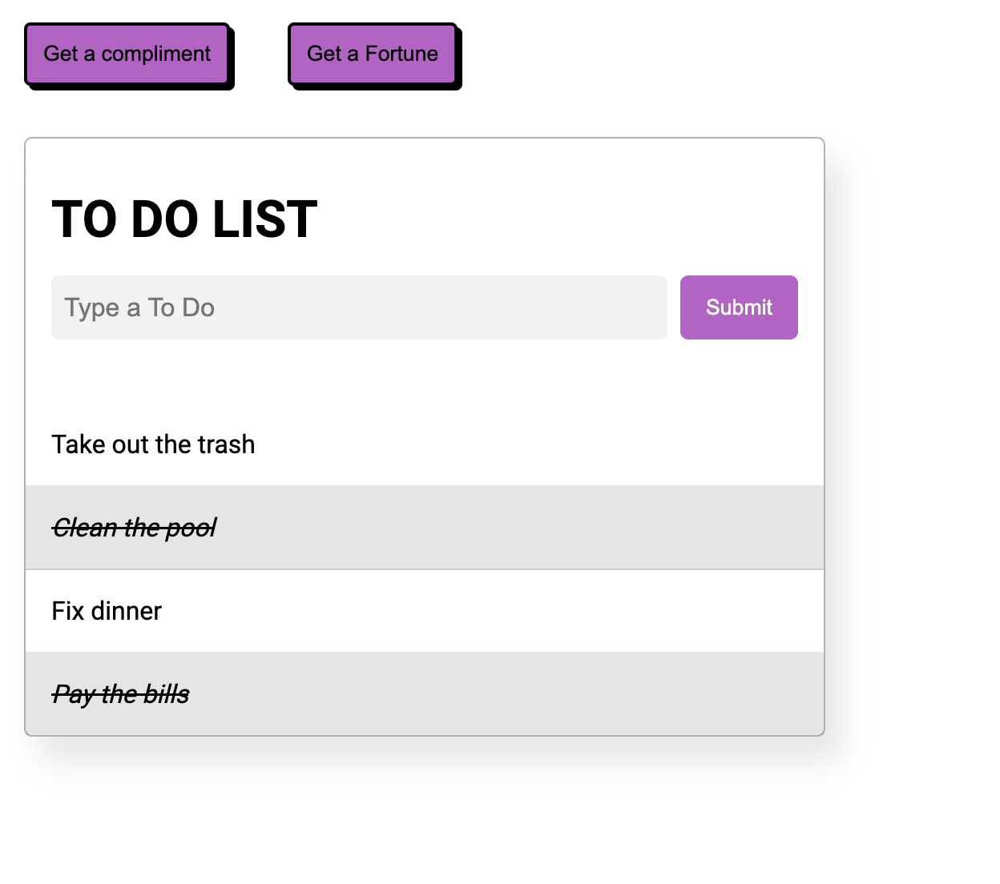

# Assessment Backend 4

- Feature 1: Get a compliment
- Feature 2: Get a fortune
- Feature 3 | 4 | 5 : Create, Update, Delete Todos

After submitting a todo, a user can click on each row to `complete` the task. If they click once more, they are prompted with a delete confirmation alert. If confirmed, the selected todo is removed from the list.

